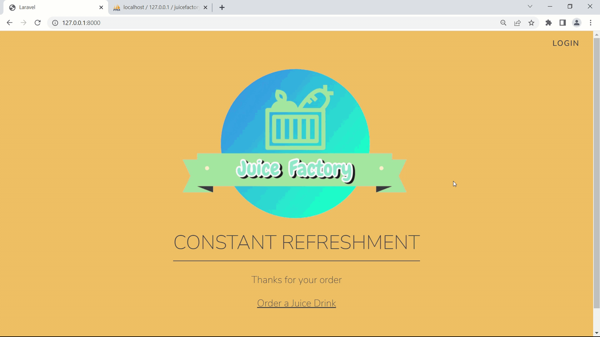
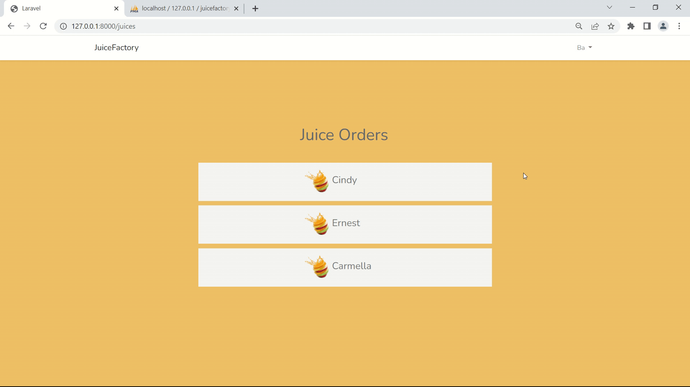

# Juice Factory
You can see the Juice Factory selection and ordering project in action viewing the gifs and images. 

# Images/Gifs below
 

Selecting and ordering the juice drink.

Login and viewing orders on the webiste and in the database.

Completing order it deletes off the website and database.

Employees can register to see and complete orders.
The register part I disabled in the code so users can't register only employees.

         
# About 
A straightforward juice drink ordering website where a user can select and order a juice drink. 
A employee of Juice Factory can log into the website and can view all the orders and complete the order. 
The juice factory project, software used for this is: Laravel (PHP framework), 
MySQL database. For the styling sass and bootstrap (css framework).

